# 杨戬(yangjian)

yangjian-agent是一个基于javaagent运行的java性能监控工具，具备较强的扩展性与性能

## 参考

该工具开发时参考的开源项目：[skywalking](https://github.com/apache/skywalking)、[MyPerf4J](https://github.com/LinShunKang/MyPerf4J )、[druid](https://github.com/alibaba/druid )；

## 功能

每秒调用量（QPS），已支持spring-controller、dubbo-client、dubbo-server、httpclient、okhttp、kafka、rabbitmq、mongo集合、mysql表及sql自动统计，jedis、redisson、方法配置化统计；

每秒平均耗时（RT），已支持spring-controller、dubbo-client、dubbo-server、httpclient、okhttp、kafka、rabbitmq、mongo集合、mysql表及sql自动统计，jedis、redisson、方法配置化统计；

连接池使用量，已支持druid、hikaricp自动统计；

进程CPU、内存占用量；

JVM内存使用量；

GC执行耗时与次数；

## 设计

> 概览图（监控全视角），其中蓝色部分为该工具运行的位置，其他部分为监控系统的整体概览；
>


### QPS/RT


> 其中蓝色部分为可扩展插件；
>

## Benchmark

### 压测环境
VM version：JDK 1.8.0_211, Java HotSpot(TM) 64-Bit Server VM, 25.211-b12

OS：Windows 10

CPU：Intel(R) Core(TM) i7-8550U CPU @ 1.80GHZ


注：以下压测只考虑应用在不安装探针的情况下和安装探针情况的对比，中间件本身性能在其各自官方一般都有提供，这里不作考虑。

### WEB场景压测
[测试用例](yangjian-agent-benchmark/src/main/java/com/yametech/yangjian/agent/benchmark/Application.java )  |  [压测脚本](docs/readme-files/jmeter.jmx )  

这个常见Springboot项目，包含SpringBoot、HikariCP连接池（模拟mysql客户端）、模拟redis客户端。

**请注意：**这里参考skywalking使用模拟客户端主要是避免服务端性能和网络的波动等这些干扰因素影响测试结果，实际上不直接跟具体mysql、redis服务交互，但操作方法会被探针拦截，跟实际使用一样。
这里使用Jmeter模拟300用户并发访问，设置思考时间为10ms，预热时间为20s

压测结果：

|Benchmark	|Baseline(基线)	|With Agent（加入探针）|
|-----------|----------------|-----------------------|
|CPU	|11.69%	|12.91%|
|Memory	|30.87%	|34%|
|ResponseTime	|164.51ms	|168.17ms|
|QPS	|1828/s	|1824/s|

从上面结果可以看出我们探针对应用性能消耗是非常小的，尤其是TPS几乎是没有影响。下面是更详细的测试数据。
#### CPU and Memory
* Baseline

* With Agent


#### QPS
* Baseline
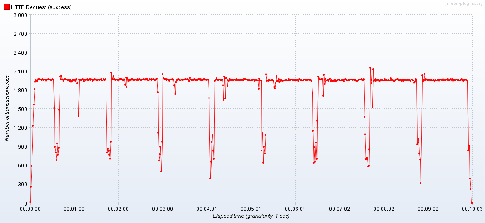
* With Agent
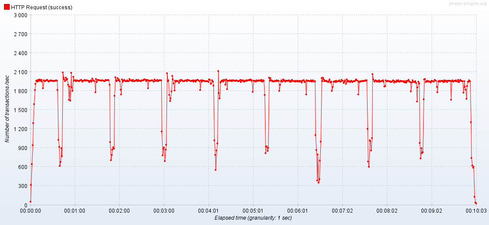

#### ResponseTime
* Baseline
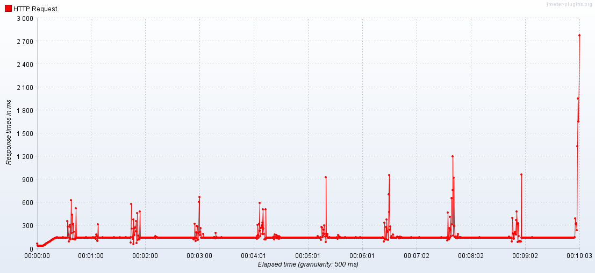
* With Agent
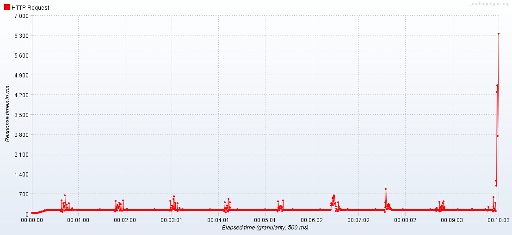


### 中间件基于JMH压测方法结果：
#### 参数说明：
 - Baseline：未加入探针
 - Throughputs：吞吐量
 - Avg：平均耗时
 - P90：90%的调用耗时在xxx以内

**注意：** 以下单个中间件操作方法压测结果会受中间服务本身性能和网络稳定性影响。

#### Mysql & Redis 模拟客户端拦截 |  [测试用例](yangjian-agent-benchmark/src/main/java/com/yametech/yangjian/agent/benchmark/combine/CombineBenchmark.java )

|Benchmark	|Baseline(基线)	|With Agent（加入探针）|
|-----------|----------------|-----------------------|
|Throughputs|0.032±0.001(ops/ms)|0.032±0.001(ops/ms)|
|Avg	|31.483±0.318ms	|31.413±0.127ms|
|P90	|32.244ms	|32.211ms|
|P95	|32.639ms	|32.796ms|
|P99	|32.899ms	|33.489ms|
|P99.9	|33.227ms	|33.489ms|

#### 拦截Http请求-1
| [测试用例](yangjian-agent-plugins/agent-plugin-httpclient/src/test/java/cn/ecpark/tool/agent/plugin/httpclient/HttpClientBenchmark.java )
| 请求外部接口：http://whois.pconline.com.cn/?ip=117.89.35.98 

|Benchmark	|Baseline(基线)	|With Agent（加入探针）|
|-----------|---------------|----------------------|
|Throughputs	|0.008±0.014(ops/ms)	|0.011±0.001(ops/ms)|
|Avg	|88.185 ± 106.477ms	|130.244 ± 626.216ms|
|P90	|103.141ms	|103.599ms|
|P95	|109.032ms	|107.217ms|
|P99	|188.623ms	|139.864ms|
|P99.9	|324.534ms	|166.986ms|

#### 拦截Http请求-2
[测试用例](yangjian-agent-plugins/agent-plugin-httpclient/src/test/java/cn/ecpark/tool/agent/plugin/httpclient/HttpClientBenchmark.java ) |  使用本地接口(该接口不做任何处理直接返回)

|Benchmark	|Baseline(基线)	|With Agent（加入探针）|
|-----------|---------------|----------------------|
|Throughputs	|3.099±0.100(ops/ms)	|3.016±0.177(ops/ms)|
|Avg	|0.321±0.006ms	|0.328±0.020ms|
|P90	|0.355ms	|0.369ms|
|P95	|0.380ms	|0.394ms|
|P99	|0.479ms	|0.507ms|
|P99.9	|1.760ms	|1.385ms|

由于请求url为外部接口受网路、接口服务器负载和稳定性等影响，压测结果会存在误差

#### 拦截Jedis方法：[测试用例](yangjian-agent-plugins/agent-plugin-jedis/src/test/java/cn/ecpark/tool/agent/plugin/jedis/RedisBenchmark.java )

结果：

|Benchmark	|Baseline(基线)	|With Agent（加入探针）|
|-----------|----------------|--------------------|
|Throughputs|	13.273±0.515(ops/ms)	|12.531±7.850(ops/ms)|
|Avg	|0.075±0.013ms	|0.084±0.015ms|
|P90	|0.083ms	|0.087ms|
|P95	|0.098ms	|0.101ms|
|P99	|0.142ms	|0.144ms|
|P99.9	|0.193ms	|0.223ms|

#### MongoDB：[测试用例](yangjian-agent-plugins/agent-plugin-mongo/src/test/java/cn/ecpark/tool/agent/plugin/mongo/MongoBenchmark.java )

| Benchmark    | Baseline(基线) | With Agent（加入探针）   |
| -------------| ---------------|-------------------------|
| Throughputs	|7.476±0.377(ops/ms)	| 6.901±0.317(ops/ms)|
|Avg	|0.133±0.001ms	|0.137±0.002ms|
|P90	|0.143ms	|0.151ms|
|P95	|0.166ms	|0.172ms|
|P99	|0.203ms	|0.206ms|
|P99.9	|0.251ms	|0.249ms|

#### Kafka 生产者：
TODO


##### 未完待续...

## 目录结构

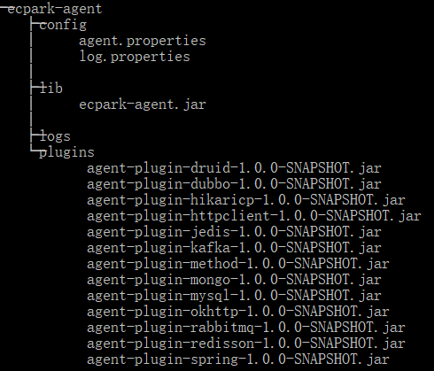

config：存放监控配置文件以及日志配置文件

​		agent.properties

| key                             | 是否必须 | 说明                                                         | 示例                                                         |
| ------------------------------- | -------- | ------------------------------------------------------------ | ------------------------------------------------------------ |
| service.name                    | 否       | 当前运行的应用名称，因日志生成目录会使用该参数，所以必须有值，该值读取顺序为：读取启动参数中的MonitorAgent.service.name，不存在则读取skywalking.agent.service_name（兼容skywalking，无需重复配置），依然不存在则使用当前配置值，未配置则不增强应用（使用默认值可能导致日志被覆盖），不支持远程配置 | test-service                                                 |
| config.remote_url               | 否       | 如果启用了远程配置，则必须配置该值，用于远程加载配置         | http://test.com/config                                       |
| spi.SPI接口实例类名             | 否       | 用于禁用一个SPI接口实例（不配置默认为启用）                  | spi.JVMMetricsSchedule=disable                               |
| ignore.enhance.classRegular     | 否       | 忽略增强的类正则，使用\r\n分隔多个配置                       | ^cn\\\\\.xxx\\\\.\r\n^cn\\\\.yyy\\\\.                        |
| ignore.enhance.methodRegular    | 否       | 忽略增强的方法正则，使用\r\n分隔多个配置                     | .\*test\\\\(\\\\)$\r\n.\*ignore\\\\(\\\\)\$                  |
| methodCallEvent.bufferSize      | 否       | 方法调用事件的缓存队列长度，必须为2的N次方，需考虑占用内存，太小可能导致事件丢弃 | 32768                                                        |
| schedule.corePoolSize           | 否       | 定时任务调度核心线程数，只要继承ISchedule的类都使用此处的线程调度 | 5                                                            |
| InstanceMethodMatcher.唯一标识  | 否       | 自定义实例方法RT/QPS统计，value为正则匹配                    | InstanceMethodMatcher.test=.\*cn\\\\.ecpark\\\\.tool\\\\.javaagent\\\\.TestService\\\\.add\\\\(.* |
| StatisticMethodMatcher.唯一标识 | 否       | 自定义静态方法RT/QPS统计，value为正则匹配                    | StatisticMethodMatcher.test=.\*java\\\\.time\\\\.Duration\\\\.ofHours\\\\(.* |

​		log.properties

| key               | 是否必须 | 说明                                                         | 示例                                                         |
| ----------------- | -------- | ------------------------------------------------------------ | ------------------------------------------------------------ |
| log.output        | 否       | 日志输出类型，目前支持：CONSOLE, FILE，如果为CONSOLE则输出到控制台，FILE则按照下方的配置输出到对应的目录下 | FILE                                                         |
| log.dir           | 否       | 日志目录，未配置时windows环境下使用程序目录，linux使用/data/www/logs/cus-ecpark-agent，实际日志输出的文件前会增加项目目录，避免一台机器部署多个接入探针应用时日志文件冲突 |                                                              |
| log.level         | 否       | 日志级别，支持：DEBUG, INFO, WARN, ERROR, OFF                | INFO                                                         |
| log.max_file_size | 否       | 单个日志文件最大大小，单位bytes                              | 31457280                                                     |
| log.max_file_num  | 否       | 日志数量，超过数量的日志文件，按照最后编辑时间删除           | 100                                                          |
| log.pattern       | 否       | 日志格式                                                     | %timestamp[%level]-[%thread]-[%class.method]: %msg%throwable |

lib：探针包

logs：探针输出的日志目录

plugins：插件包

## 接入

### 启动脚本

#### Main启动

> 接入前的启动脚本：

```sh
java -Dfile.encoding=utf-8 -Xms256m -Xmx512m -cp ../conf:../lib/* com.xxx.Application
```

> 接入后，调整为：

```sh
java -Dfile.encoding=utf-8 -Xms256m -Xmx512m -javaagent:/目录/lib/yangjian-agent.jar -DMonitorAgent.service.name=应用名称 -cp ../conf:../lib/* com.xxx.Application
```

#### jar启动

> 接入前的启动脚本：

```sh
java -Dfile.encoding=utf-8 -Xms256m -Xmx512m -jar yourApp.jar
```

> 接入后，调整为：

```sh
java -Dfile.encoding=utf-8 -Xms256m -Xmx512m -javaagent:/目录/lib/yangjian-agent.jar -DMonitorAgent.service.name=应用名称 -jar yourApp.jar
```

#### tomcat项目

> linux系统，在tomcat的启动文件tomcat/bin/catalina.sh第一行加：

```sh
CATALINA_OPTS="$CATALINA_OPTS -javaagent:/目录/lib/yangjian-agent.jar -DMonitorAgent.service.name=应用名称";
export CATALINA_OPTS
```

> windows系统，在tomcat的启动文件tomcat/bin/catalina.bat第一行加：

```sh
set "CATALINA_OPTS=-javaagent:/目录/lib/yangjian-agent.jar -DMonitorAgent.service.name=应用名称"
```

### 统计日志示例

```
2020-02-05 06:24:51.744[INFO]-[schedule-8]-[c.e.t.a.c.u.LogUtil.println(71)]: ecpark-monitor/1580855091/method-event/consume?total_num=116594210&period_seconds=2&period_num=4651
2020-02-05 06:24:51.743[INFO]-[schedule-9]-[c.e.t.a.c.u.LogUtil.println(71)]: ecpark-monitor/1580855091/resources?direct_memory=28347&mapped_cache=0&heap=2831007&non_heap=130363
2020-02-05 06:24:51.744[INFO]-[schedule-7]-[c.e.t.a.c.u.LogUtil.println(71)]: ecpark-monitor/1580855091/method-event/product?total_num=116594210&period_seconds=2&period_num=4651&total_discard_num=0&period_discard_num=0
2020-02-05 06:24:51.744[INFO]-[schedule-7]-[c.e.t.a.c.u.LogUtil.println(71)]: ecpark-monitor/1580855091/statistic/hikaricp/connectionPool?hikaricp_active_count=0&hikaricp_max_total=10
2020-02-05 06:24:51.744[INFO]-[schedule-8]-[c.e.t.a.c.u.LogUtil.println(71)]: ecpark-monitor/1580855088/statistic/hikaricp/RT?sign=192.168.9.254%3A6301%2Fecpark_monitor+%7C+GetConnection&rt_max=1&rt_min=0&num=142&rt_total=2
2020-02-05 06:24:51.744[INFO]-[schedule-8]-[c.e.t.a.c.u.LogUtil.println(71)]: ecpark-monitor/1580855088/statistic/mysql-table/RT?sign=node_log+%7C+Update&rt_max=5&rt_min=1&num=252&rt_total=623
2020-02-05 06:24:51.744[INFO]-[schedule-8]-[c.e.t.a.c.u.LogUtil.println(71)]: ecpark-monitor/1580855090/statistic/kafka-publish/RT?sign=TOPIC-STATISTIC-UNIFIED&rt_max=0&rt_min=0&num=2&rt_total=0
2020-02-05 06:24:51.744[INFO]-[schedule-8]-[c.e.t.a.c.u.LogUtil.println(71)]: ecpark-monitor/1580855088/statistic/mysql-sql/RT?sign=select+id%2Cname+from+app++where+name%3D%3F&rt_max=2&rt_min=0&num=15&rt_total=16
2020-02-11 14:34:23.869[INFO]-[schedule-4]-[c.e.t.a.c.u.LogUtil.println(71)]: ecpark-monitor/1581402862/statistic/method/RT?sign=TestService.add%28int%2Cint%29&rt_max=0&rt_min=0&num=10&rt_total=0
```

### UI效果图

以下截图为统计数据结合Grafana的展示效果

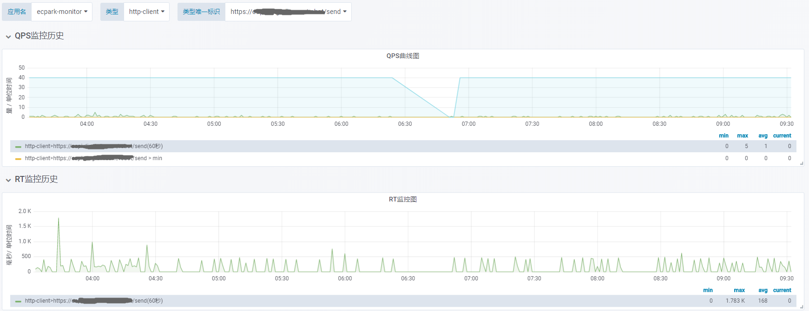

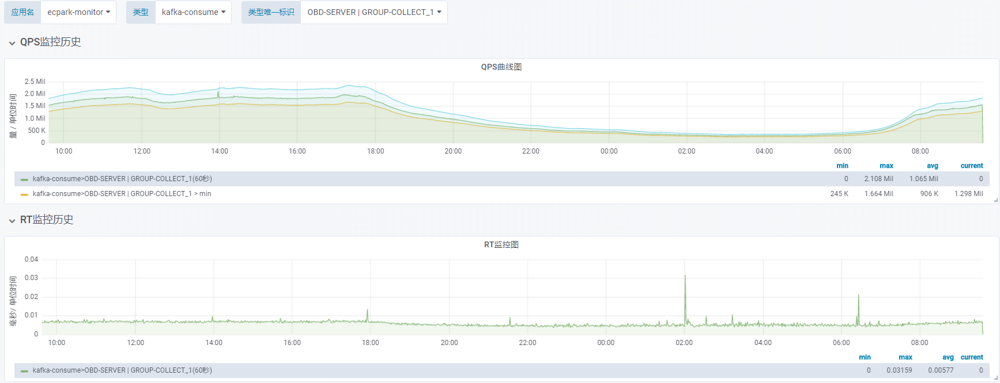

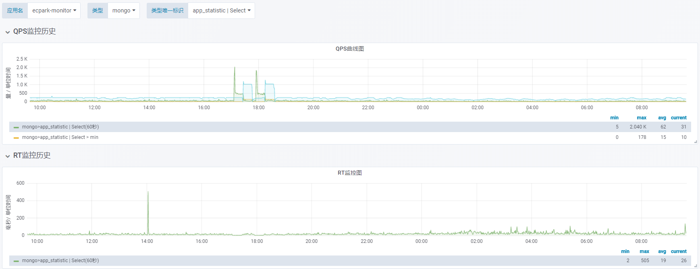

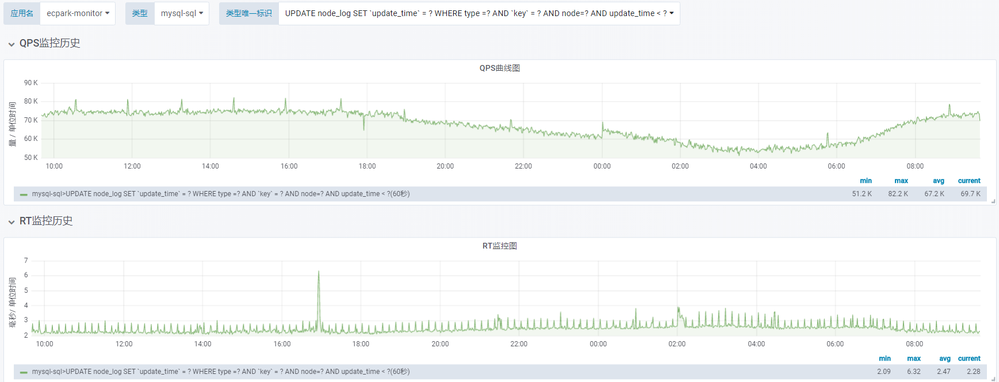

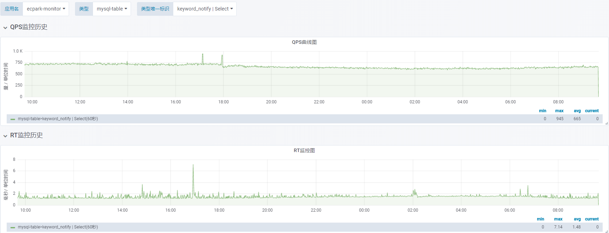

## 打包

在项目根目录下执行：`mvn clean package`，根目录下生成的deploy目录文件，即为部署文件

## 扩展（接口）

创建项目并引入api包（yangjian-agent-api，该包无其他依赖），可支持以下接口自定义扩展（可参考现有插件的实现方式）：

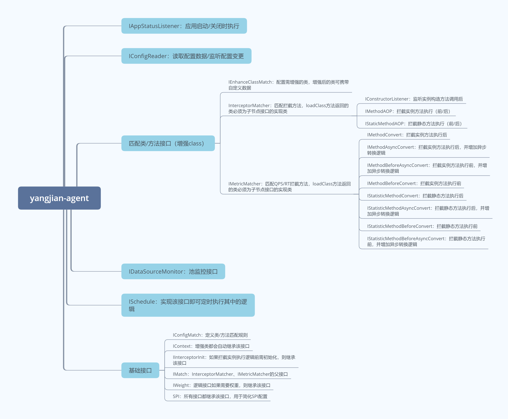

### 快速扩展示例

场景：只监控TestService.execute(String cmd)的QPS/RT，以下为业务代码

> 注意：当前场景仅说明如何扩展插件，实际上该场景目前已有插件支持，仅需要配置拦截的类方法定义即可统计QPS/RT；

```java
package cn.xxx.plugin.test;

public class TestService {
	public void execute() {
		// 业务逻辑
		System.err.println("execute()");
	}
    public void execute(String cmd) {
		// 业务逻辑
    	System.err.println("execute(String cmd)");
	}
    public void execute(Integer index) {
		// 业务逻辑
    	System.err.println("execute(Integer index)");
	}
}
```

1、创建maven项目：agent-plugin-test（名称无要求）

2、pom包依赖及配置修改（JDK8及以上）

```xml
<properties>
    <project.build.sourceEncoding>UTF-8</project.build.sourceEncoding>
    <project.reporting.outputEncoding>UTF-8</project.reporting.outputEncoding>
    <java.version>1.8</java.version>
    <maven.compiler.source>1.8</maven.compiler.source>
    <maven.compiler.target>1.8</maven.compiler.target>
    <maven.compiler.compilerVersion>1.8</maven.compiler.compilerVersion>
</properties>

<dependencies>
    <dependency>
        <groupId>com.yametech.yangjian.agent</groupId>
        <artifactId>yangjian-agent-api</artifactId>
        <version>1.0.0-SNAPSHOT</version>
    </dependency>
</dependencies>
```

3、实现IMetricMatcher接口，设置拦截方法

```java
package cn.xxx.plugin.test;

import java.util.Arrays;

import com.yametech.yangjian.agent.api.IMetricMatcher;
import com.yametech.yangjian.agent.api.base.IConfigMatch;
import com.yametech.yangjian.agent.api.base.MethodType;
import com.yametech.yangjian.agent.api.bean.LoadClassKey;
import com.yametech.yangjian.agent.api.configmatch.CombineAndMatch;
import com.yametech.yangjian.agent.api.configmatch.MethodArgumentIndexMatch;
import com.yametech.yangjian.agent.api.configmatch.MethodArgumentNumMatch;
import com.yametech.yangjian.agent.api.configmatch.MethodRegexMatch;

public class TestMatcher implements IMetricMatcher {

	@Override
	public IConfigMatch match() {
		return new CombineAndMatch(Arrays.asList(
				new MethodRegexMatch(".*cn\\.xxx\\.plugin\\.test\\.TestService\\.execute\\(.*"),// 拦截的类及方法定义
				new MethodArgumentNumMatch(1), // 方法参数个数
				new MethodArgumentIndexMatch(0, "java.lang.String")// 方法参数类型
			));
	}

	@Override
	public String type() {
		return "test-type";// 当前QPS/RT的类型，用于UI展示时分组
	}

	@Override
	public LoadClassKey loadClass(MethodType type) {
		return new LoadClassKey("cn.xxx.plugin.test.TestConvert");// 拦截后执行的逻辑
	}
}
```

4、实现IMethodConvert接口，完成方法调用转TimeEvent

```java
package cn.xxx.plugin.test;

import java.lang.reflect.Method;
import java.util.Arrays;
import java.util.List;
import java.util.Map;

import com.yametech.yangjian.agent.api.bean.TimeEvent;
import com.yametech.yangjian.agent.api.convert.IMethodConvert;

public class TestConvert implements IMethodConvert {

	@Override
	public List<TimeEvent> convert(Object thisObj, long startTime, Object[] allArguments, 
			Method method, Object ret, Throwable t, Map<Class<?>, Object> globalVar) throws Throwable {
		TimeEvent event = get(startTime);
		event.setIdentify("TestService.execute(String)");
		return Arrays.asList(event);
	}
}
```

5、在项目目录/src/main/resources/META-INF/services下增加文件`com.yametech.yangjian.agent.api.base.SPI`，并添加以下内容

```
cn.xxx.plugin.test.TestMatcher
```

6、打包

```
maven clean package
```

7、复制`\target\agent-plugin-test-1.0.0-SNAPSHOT.jar`到探针包目录plugins下

8、增加一个main方法测试拦截，并按照文档中的接入-> 启动脚本 -> Main启动

> 如果在IDE下运行，配置对应IDE的启动参数，eclipse可在Run Configurations ...找到对应的Java Application，在Arguments -> VM arguments下增加：`-javaagent:\探针包目录\lib\yangjian-agent.jar -DMonitorAgent.service.name=agent-main-test`

```java
package cn.xxx.plugin.test;

public class Main {
	public static void main(String[] args) {
		TestService service = new TestService();
		service.execute();
		service.execute(1);
		service.execute("123");
		System.exit(0);
	}
}
```

9、修改log.properties的`log.output`为CONSOLE（可在控制台或者运行窗口直接看到输出日志），启动main，如果出现以下日志则拦截成功（可搜索`statistic/test-type`）

```
2020-02-07 11:08:36.515[INFO]-[schedule-2]-[c.e.t.a.c.u.LogUtil.println(71)]: agent-main-test/1581044915/statistic/test-type/RT?sign=TestService.execute%28String%29&rt_max=1&rt_min=1&num=1&rt_total=1
```

> 日志说明：[*应用名称*]/[*方法执行时的秒数*]/statistic/[*TestMatcher中配置的type*]/[RT/QPS]?sign=[*setIdentify配置的*]&rt_max=[*当前秒最大耗时毫秒数*]&rt_min=[*当前秒最小耗时毫秒数*]&num=[*当前秒总执行次数*]&rt_total=[*总耗时毫秒数*]

### IConfigMatch实现使用说明

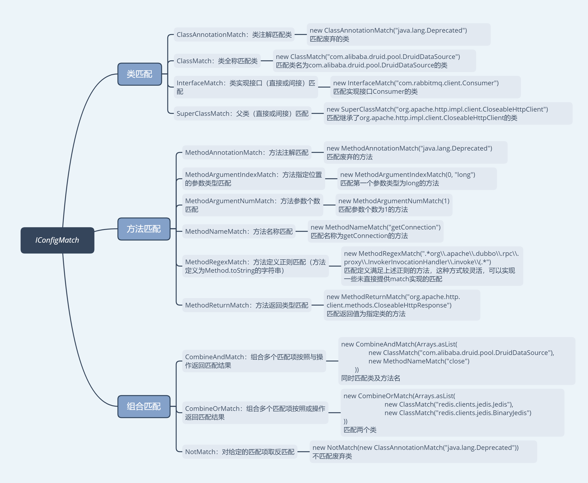
